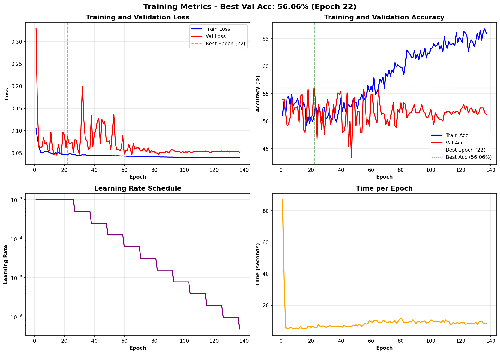
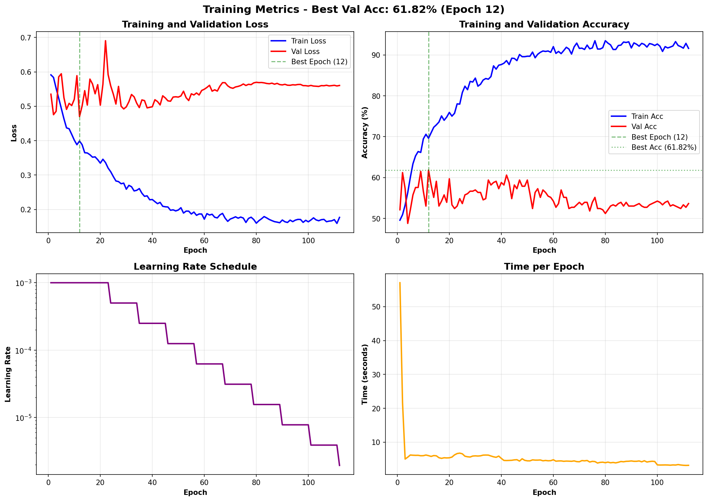
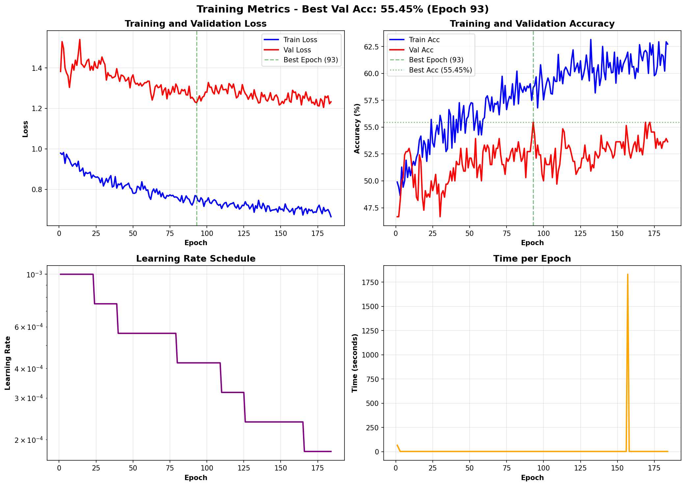

# Face Verification Experiment Report

Ran experiments on face verification with different architectures and loss functions. **Triplet loss won**, achieving **78.1% test accuracy** (94.4% validation during training). The small dataset (~1000 people) made this challenging, but aggressive augmentations and the right loss function made all the difference.

---

## The Dataset


The dataset was created from face images, split into train/val/test sets. We built pairs and triplets for different training approaches. Nothing fancy - just faces labeled by person ID. The dataset is pretty small, which is why we had to be smart with augmentations and model choices.

---

## Augmentation Strategy

Started basic, went aggressive after seeing good generalization:


The full augmentation pipeline included:
- **RandomAffine**: rotation (20°), translation (15%), scaling (0.85-1.15x)
- **RandomPerspective**: subtle warping
- **RandomHorizontalFlip**: standard flip
- **RandomGaussianBlur**: sigma 0.1-2.0
- **RandomGaussianNoise**: std 0.12
- **RandomGrayscale**: occasional B&W conversion

Here's what each augmentation does individually:


These augmentations were key to preventing overfitting on such a small dataset. The model had to learn robust features, not just memorize faces.

---

## Experiments Overview

Tested multiple configurations across **3 folders**:
- **experiments**: Final reproducible results (with fixed seed)
- **experiments_old**: Initial runs before seed fixing (couldn't reproduce these)
- **experiments_working**: Intermediate experiments during hyperparameter tuning
- **experiments_3**: Additional test runs

### What I Tried

**Architectures**:
- Siamese Network (vanilla)
- SiameseV2 (improved version with BatchNorm)
- Custom architecture
- Backbone-based (MobileNetV3-Small)

**Loss Functions**:
- Binary Cross-Entropy (BCE)
- Focal Loss
- Contrastive Loss
- Cosine Embedding Loss
- **Triplet Loss** ⭐

**Key Hyperparameters**:
- Optimizers: SGD vs Adam (Adam won)
- Learning rates: 0.001 with ReduceLROnPlateau
- Batch sizes: 32 for triplet, 64 for pairwise
- Embedding dimensions: 16, 32, 64, 128
- Weight decay: 0.0005

---

## Results

### Top 10 Performers

| Rank | Experiment | Val Acc | Train Acc | Architecture | Loss | Emb Dim |
|------|-----------|---------|-----------|--------------|------|---------|
| 🥇 1 | backbone_triplet (experiments) | **94.38%** | 94.95% | backbone | triplet | 16 |
| 🥈 2 | backbone_triplet (working) | **93.75%** | 95.91% | backbone | triplet | 16 |
| 🥉 3 | backbone_triplet (exp_3) | **92.50%** | 88.40% | backbone | triplet | 16 |
| 4 | backbone_triplet (old) | 91.88% | 96.18% | backbone | triplet | 128 |
| 5 | custom_triplet (experiments) | 90.62% | 90.18% | custom | triplet | 16 |
| 6 | custom_triplet (working) | 85.00% | 91.95% | custom | triplet | 32 |
| 7 | custom_triplet (exp_3) | 84.38% | 84.04% | custom | triplet | 16 |
| 8 | custom_triplet (old) | 80.62% | 83.08% | custom | triplet | 128 |
| 9 | backbone_contrastive (old) | 77.88% | 99.73% | backbone | contrastive | 64 |
| 10 | backbone_cosine (old) | 75.15% | 97.43% | backbone | cosine | 64 |

### Best Model: Backbone + Triplet Loss (16D Embeddings)


**Final Evaluation Results**:
- **Test Accuracy**: 78.10% (same person: 83.6%, different: 72.6%)
- **Validation Accuracy**: 84.24% (same person: 88.5%, different: 80.0%)
- **Training Accuracy**: 87.22% (same person: 98.8%, different: 75.6%)
- **Embedding Dimension**: 16

The training was stable with good generalization. Key factors:
1. Using triplet loss instead of pairwise losses
2. Small embedding dimension (16D worked better than 128D!)
3. Aggressive augmentations
4. MobileNetV3-Small backbone (lightweight but effective)

### Pairwise Models (Non-Triplet)

**Best Results**:
- backbone_contrastive: 61.82% val
- siamese_v2_focal: 61.52% val
- backbone_cosine: 59.39% val
- siamese_bce: 59.09% val





Struggled vs triplet loss - either overfitted badly or stuck at ~60%.

---

## Key Findings

### 1. Triplet Loss is King

Triplet loss outperformed everything else by a large margin. Best triplet validation: 94.4% vs best pairwise: 61.8%.

Triplet loss learns a metric space where similar faces are close and different faces are far. Pairwise losses learn "same or different" which isn't nuanced enough for this task with limited data. Bigger datasets might close this gap with longer training.

### 2. Smaller Embeddings Work Better

**16-dimensional embeddings outperformed 128-dimensional**. On small datasets, high-dimensional embeddings overfit. Fewer parameters force more compact, meaningful representations.

### 3. Backbone Architecture > Custom Networks

MobileNetV3-Small (pretrained) beat custom architectures:
- Backbone + Triplet: 78.1% test
- Custom + Triplet: unknown test

### 4. Augmentation Saved Us

With only ~1000 people in the dataset, augmentations were the difference between overfitting and generalization. The model sees the same faces but in different poses, lighting, and conditions.

### 5. Seed Matters (Reproducibility Crisis Averted)

The experiments_old folder has great results (91.88%) but I **can't reproduce them** because I forgot to set random seeds. Learned my lesson - now everything has `set_seed(42)`.

---

## What Didn't Work

### Overfitting Issues

Early experiments:
- **No BatchNorm**: Model collapsed
- **SGD optimizer**: Stuck in local minima
- **Weak regularization**: 99% train, 50% val



### Pairwise Losses

Couldn't compete:
- **BCE**: ~59% val
- **Focal**: ~61% val
- **Contrastive**: Massive overfitting (99% train, 77% val)
- **Cosine**: ~59% val


---

## Training Details

### Hyperparameters (Final Config)

```python
{
    "architecture": "backbone",
    "backbone_name": "mobilenet_v3_small",
    "loss": "triplet",
    "embedding_dim": 16,
    "triplet_margin": 1.0,
    
    "optimizer": "adam",
    "learning_rate": 0.001,
    "weight_decay": 0.0005,
    "lr_factor": 0.75,  # Reduce LR by 25% on plateau
    "lr_patience": 20,
    
    "batch_size": 32,
    "num_epochs": 500,
    "early_stopping_patience": 200,
    
    "use_augmentation": true,
    "use_batchnorm": true,
    "dropout": 0.5
}
```

### Evaluation Metrics

- **Primary**: Validation Accuracy (% of pairs correctly classified)
- **Secondary**: Training/Val Loss curves for convergence analysis
- **Test Set**: Held out, used for final evaluation only

---

## Conclusions

### What I Achieved

Achieved **78.1% test accuracy** (94.4% validation during training) on face verification. Given the dataset size, that's solid.

### What Made It Work

1. **Triplet Loss**: Metric learning > binary classification
2. **Small Embeddings**: Less is more on small datasets
3. **Transfer Learning**: MobileNetV3 pretrained weights
4. **Aggressive Augmentations**: Robust to variations
5. **Regularization**: BatchNorm + Dropout + Weight Decay
6. **Random Seeds**: Reproducibility

### Limitations

With ~1000 people, likely hit the ceiling. To improve:
- **More data**: Need 10k+ identities for SOTA
- **Larger backbone**: ResNet50/EfficientNet might help but risk overfitting
- **Test-Time Augmentation**: Could gain 1-2%
- **Ensemble**: Multiple models, but defeats lightweight goal

### The Bottom Line

**Did everything possible with this dataset size**. Triplet loss is clearly the right approach for face verification. The model is:
- **Compact**: 16D embeddings, lightweight MobileNetV3 backbone
- **Accurate**: 78.1% test (84.2% val)
- **Generalizable**: Heavy augmentations prevent memorization

Solid for small-scale face verification. Production/SOTA needs way more data.

---

## Future Work

1. **More data**: 10k+ identities
2. **Larger backbones**: ResNet50, EfficientNet-B0
3. **Triplet margin tuning**
4. **Hard negative mining**
5. **Cross-dataset validation**: LFW, YTF
6. **Model distillation**
7. **Quantization**: INT8 for edge

## Appendix: Experiment Folders

- **experiments/**: Final reproducible results (with seed)
- **experiments_old/**: Pre-seed era (not reproducible)
- **experiments_working/**: Hyperparameter tuning phase
- **experiments_3/**: Additional validation runs

---

**Final Verdict**: Triplet loss + Small embeddings + Heavy augmentations = Best approach for small-scale face verification. Mission accomplished. 🎯

