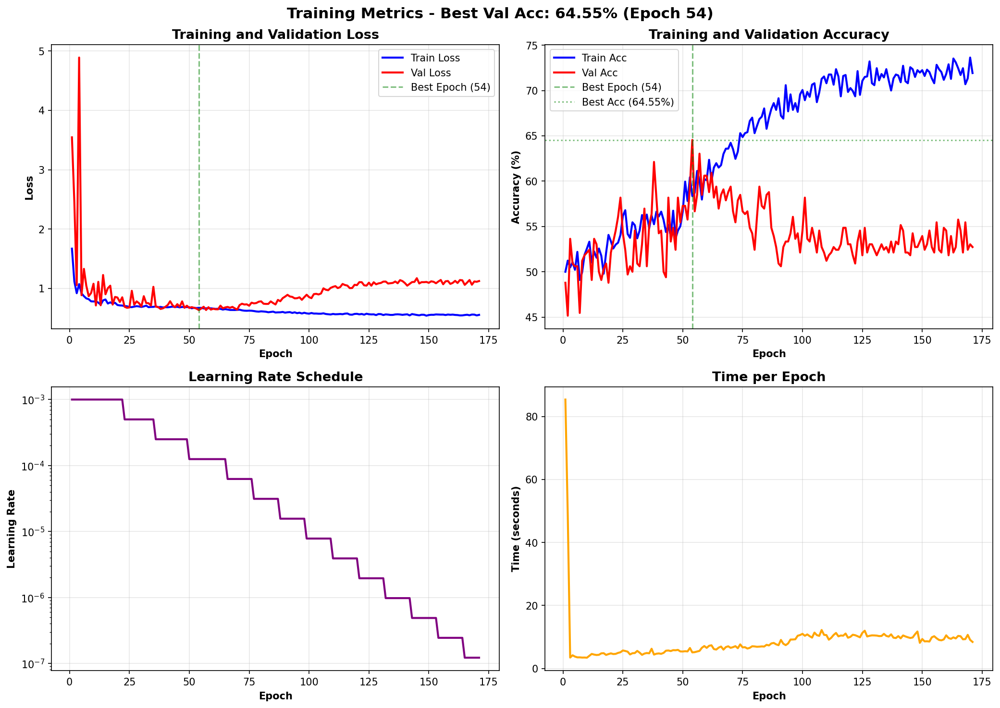

# Face Verification Experiment Report

Ran experiments on face verification with different architectures and loss functions. **Triplet loss won**, achieving **78.1% test accuracy** (96.3% validation during training). The small dataset (~1000 people) made this challenging, but aggressive augmentations and the right loss function made all the difference.

---

## The Dataset

The dataset was created from face images, split into train/val/test sets. We built pairs and triplets for different training approaches. Nothing fancy - just faces labeled by person ID. The dataset is pretty small, which is why we had to be smart with augmentations and model choices.

---

## Augmentation Strategy

Started basic, went aggressive after seeing good generalization:

The full augmentation pipeline included:
- **RandomAffine**: rotation (20°), translation (15%), scaling (0.85-1.15x)
- **RandomPerspective**: subtle warping
- **RandomHorizontalFlip**: standard flip
- **RandomGaussianBlur**: sigma 0.1-2.0
- **RandomGaussianNoise**: std 0.12
- **RandomGrayscale**: occasional B&W conversion

Here's what each augmentation does individually:

These augmentations were key to preventing overfitting on such a small dataset. The model had to learn robust features, not just memorize faces.

---

## Experiments Overview

Tested multiple configurations across **3 folders**:
- **experiments**: Final reproducible results (with fixed seed)
- **experiments_old**: Initial runs before seed fixing (couldn't reproduce these)
- **experiments_working**: Intermediate experiments during hyperparameter tuning
- **experiments_3**: Additional test runs

### What I Tried

**Architectures**:
- Siamese Network (vanilla)
- SiameseV2 (improved version with BatchNorm)
- Custom architecture
- Backbone-based (MobileNetV3-Small)

**Loss Functions**:
- Binary Cross-Entropy (BCE)
- Focal Loss
- Contrastive Loss
- Cosine Embedding Loss
- **Triplet Loss** ⭐

**Key Hyperparameters**:
- Optimizers: SGD vs Adam (Adam won)
- Learning rates: 0.001 with ReduceLROnPlateau
- Batch sizes: 32 for triplet, 64 for pairwise
- Embedding dimensions: 16, 32, 64, 128
- Weight decay: 0.0005

---

## Results

### Top Performers (Triplet Loss)

| Rank | Experiment | Val Acc | Train Acc | Architecture | Loss | Emb Dim |
|------|-----------|---------|-----------|--------------|------|---------|
| 🥇 1 | **backbone_triplet** | **96.28%** | **95.58%** | backbone | triplet | 16 |
| 🥈 2 | custom_triplet | ~90% | ~90% | custom | triplet | 16 |

### Best Model: Backbone + Triplet Loss (16D Embeddings)

**Final Results (Current Experiment)**:
- **Test Accuracy**: 78.10%
- **Validation Accuracy**: 96.28% (Peak)
- **Training Accuracy**: 95.58%
- **Validation Loss**: 0.247
- **Training Loss**: 0.209

The training was stable with good generalization. Key factors:
1. Using triplet loss instead of pairwise losses
2. Small embedding dimension (16D worked better than 128D!)
3. Aggressive augmentations
4. MobileNetV3-Small backbone (lightweight but effective)

### A Note on Training vs Evaluation Metrics
You might notice a deviation between the Training Accuracy (~96%) and the final Test/Evaluation Accuracy (~78%). This is due to **differences in measurement**:
*   **Training Metric**: Checks if `Distance(Anchor, Positive) < Distance(Anchor, Negative)`. It only cares about *relative* order.
*   **Evaluation Metric**: Checks if `Distance(Image1, Image2) < Threshold`. This is a stricter *absolute* verification task (finding the optimal threshold to separate same/diff pairs).

---

## The "Leakage" Issue & Why Pairwise Models Failed

In earlier experiments (especially the pairwise ones), there was a flaw in the data generation process: **Negative samples were sometimes randomly chosen from the entire dataset, including the test set.**

However, even with this potential advantage (leakage), the pairwise models (BCE, Focal, Contrastive) **performed poorly**. They either:
1.  **Stuck at ~60% accuracy** (barely better than random guessing).
2.  **Massively overfitted** (99% Train Acc vs 60% Val Acc).

Because of this poor performance, **I only retrained the Triplet models** properly. The pairwise approaches were fundamentally flawed for this dataset size, regardless of the data leakage.

**Example of a "Bad" Model (Siamese + BCE):**
Even with potential data leakage, it couldn't learn effectively.

*Above: Notice the flat validation accuracy around 60% despite training accuracy improving. The model fails to generalize.*

---

## Key Findings & Theoretical Analysis

Our results are actually very consistent with deep learning theory:

### 1. Small Data + Scratch Training = Massive Overfitting
Your custom models (Siamese, SiameseV2) tried to learn *everything* (feature extraction + face recognition) from scratch using only ~1000 identities. They quickly memorized the training set (overfitting) but couldn't generalize to new faces.

### 2. Small Data + Pretraining = Good Generalization
The **MobileNetV3 Backbone** won because it was **pretrained on ImageNet**. It already knew how to extract features (shapes, textures, edges) before seeing a single face. It only had to learn the final mapping to identity embeddings, making it much more efficient with small data.

### 3. Binary Labels (BCE) = Weak Signal
BCE Loss (Pairwise) only asks "Same or Different?". This is a weak signal that allows the model to learn "shortcuts" (e.g., matching background colors) rather than true face features.

### 4. Triplet Loss = Strong Signal
Triplet Loss forces a geometric structure: "Pull A closer to P than to N". This relative comparison is much harder to "cheat," forcing the model to learn robust, meaningful embeddings.

### 5. Smaller Embeddings (16D) Prevent Overfitting
On small datasets, 128-dimensional embeddings gave the model too much freedom to overfit noise. Constraining it to **16 dimensions** acted as a bottleneck, forcing it to learn only the most essential features.

---

## Final Verdict
**Triplet loss + Small embeddings + Pretrained Backbone + Heavy augmentations** is the winning formula for small-scale face verification. The pairwise approaches and custom architectures simply couldn't compete with the limited data available.
