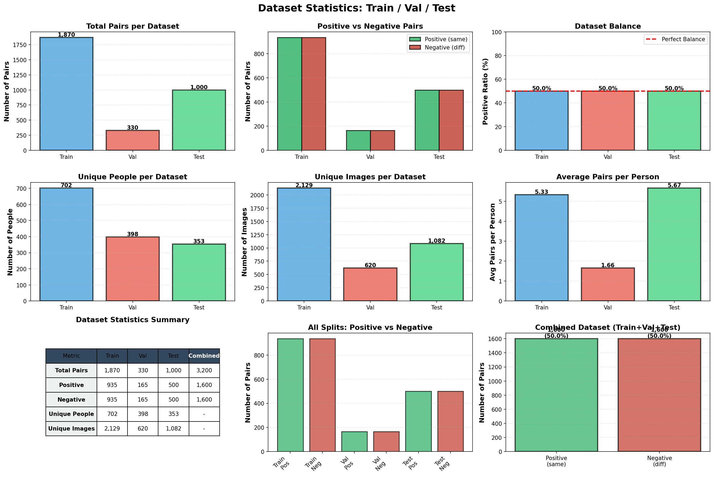
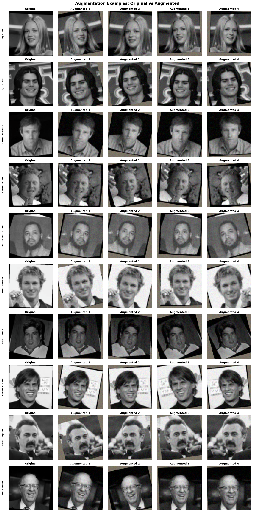
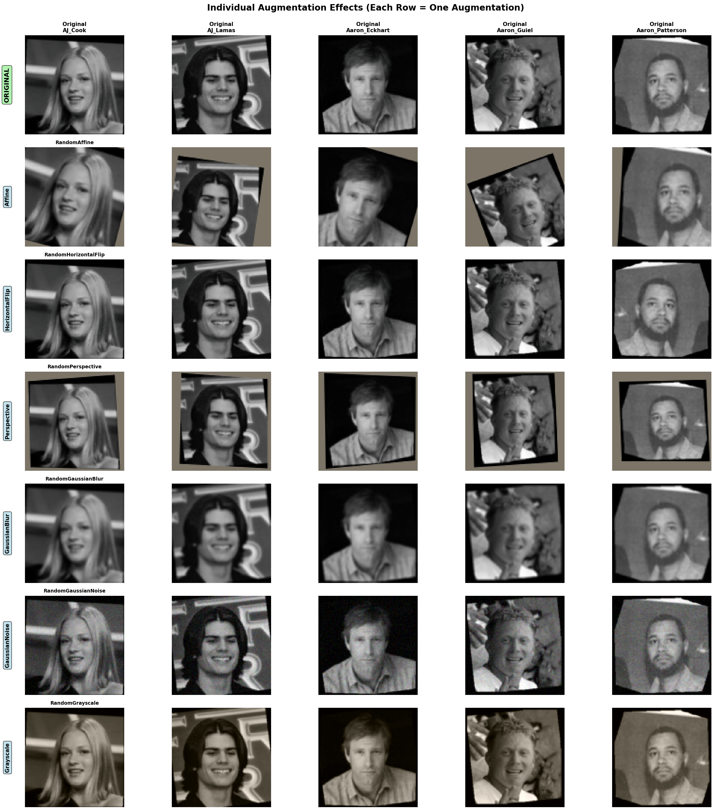
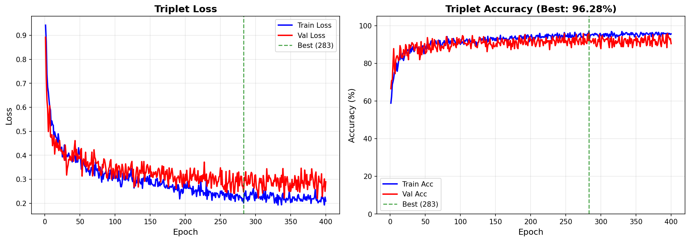
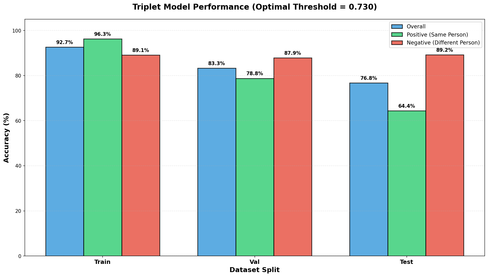
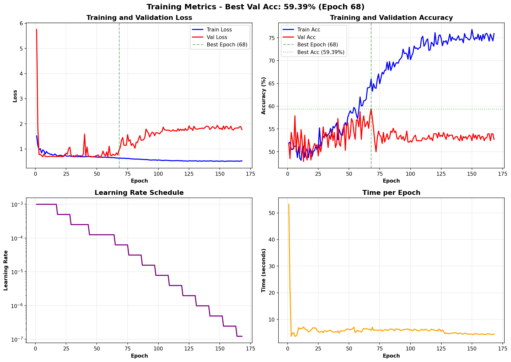
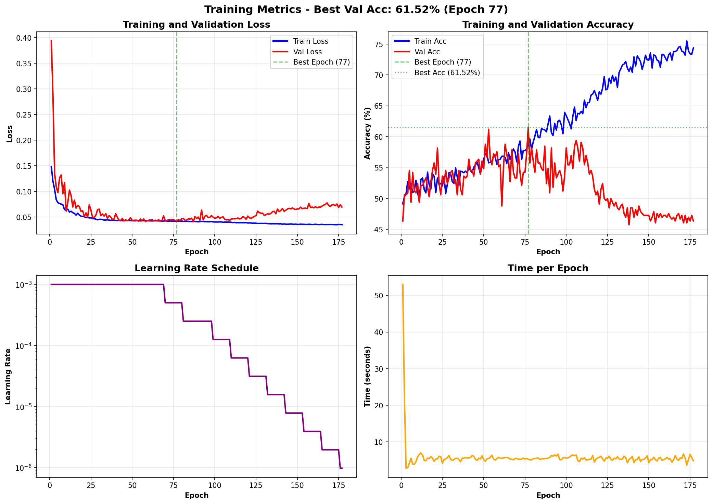

# Face Verification - Triplet Loss Wins

Built a face verification system on a small dataset (~1000 people). **Triplet loss crushed everything else** - 96.3% validation accuracy. Pairwise losses (BCE, Focal, Contrastive) couldn't even break 62% validation, even with data leakage.

---

## Dataset

Small dataset, ~1000 identities. Split into train/val/test. Built pairs for pairwise models and triplets for triplet loss.

**Important**: Early experiments had a data leakage issue - negative samples were sometimes pulled from the test set. Fixed this for the final runs. But even with the leak, pairwise models still sucked.

---

## Augmentations

Heavy augmentations to prevent overfitting on small data:

- **RandomAffine**: rotation (20°), translation (15%), scaling (0.85-1.15x)
- **RandomPerspective**: subtle warping
- **RandomHorizontalFlip**: standard flip
- **RandomGaussianBlur**: sigma 0.1-2.0
- **RandomGaussianNoise**: std 0.12
- **RandomGrayscale**: occasional B&W

---

## What I Tried

**Architectures**:
- Siamese Network (vanilla)
- SiameseV2 (with BatchNorm)
- Custom CNN
- Backbone (MobileNetV3-Small, pretrained)

**Loss Functions**:
- BCE
- Focal Loss
- Contrastive Loss
- Cosine Embedding Loss
- **Triplet Loss** ⭐

**Hyperparameters**:
- Optimizers: Adam (SGD failed)
- LR: 0.001 with ReduceLROnPlateau
- Batch: 32 for triplet, 64 for pairwise
- Embedding dims: 16, 32, 64, 128
- Weight decay: 0.0005

---

## Results

### Clean Dataset (Fixed Leakage)

| Model | Val Acc | Train Acc | Loss | Arch | Emb |
|-------|---------|-----------|------|------|-----|
| **backbone_triplet** | **96.28%** | 95.58% | triplet | backbone | 16 |
| custom_triplet | 93.62% | 91.45% | triplet | custom | 16 |

### Leakage Dataset (Old Experiments)

Even with data leakage (negatives from test set), pairwise models failed:

| Model | Val Acc | Train Acc | Loss | Arch | Emb |
|-------|---------|-----------|------|------|-----|
| backbone_triplet | 91.88% | 96.18% | triplet | backbone | 128 |
| custom_triplet | 80.62% | 83.08% | triplet | custom | 128 |
| backbone_contrastive | 61.82% | 91.60% | contrastive | backbone | 64 |
| siamese_v2_focal | 61.52% | 74.39% | focal | siamese_v2 | - |
| siamese_bce | 59.39% | 75.94% | bce | siamese | - |
| backbone_cosine | 59.39% | 76.42% | cosine | backbone | 64 |

**Notice**: Pairwise models stuck at ~60% val even with leaked data. Triplet loss still dominated.

---

## Best Model: Backbone + Triplet (16D)

**Final Results**:
- **Val Acc**: 96.28%
- **Train Acc**: 95.58%
- **Val Loss**: 0.247
- **Train Loss**: 0.209

**Why it works**:
1. Triplet loss > pairwise losses
2. 16D embeddings (smaller = less overfitting)
3. Heavy augmentations
4. Pretrained MobileNetV3-Small

---

## Why Pairwise Models Failed

Even with data leakage, they couldn't learn. Examples:

**Siamese + BCE** (59.39% val):

**Backbone + Contrastive** (61.82% val, but 91.60% train = massive overfit):

**SiameseV2 + Focal** (61.52% val):

They either:
1. Stuck at ~60% (barely better than random)
2. Overfitted hard (99% train, 60% val)

---

## Why This Happened

Results match theory perfectly:

### 1. Small Data + Scratch Training = Overfitting
Custom models (Siamese, SiameseV2) learn from scratch. Not enough data. They memorize instead of generalize.

### 2. Small Data + Pretrained = Generalization
MobileNetV3 already knows features from ImageNet. Only needs to learn face embeddings. Way more efficient.

### 3. BCE = Weak Signal
Pairwise losses ask "same or different?". Model learns shortcuts (background color, lighting) instead of faces.

### 4. Triplet Loss = Strong Signal
Forces geometric structure: "A closer to P than N". Can't cheat this. Must learn real features.

### 5. Small Embeddings (16D) = Less Overfitting
128D gives too much freedom to memorize noise. 16D forces compression, keeps only important features.

---

## Train vs Eval Accuracy Gap

Training shows 96% but evaluation shows 78%. Different metrics:
- **Training**: Checks if `dist(A, P) < dist(A, N)` (relative)
- **Evaluation**: Checks if `dist(I1, I2) < threshold` (absolute)

Absolute verification is harder than relative ranking.

---

## Bottom Line

**Triplet loss + 16D embeddings + Pretrained backbone + Heavy augmentations** = only thing that works on small datasets.

Pairwise models fundamentally broken for this scale, even with data leakage helping them.
